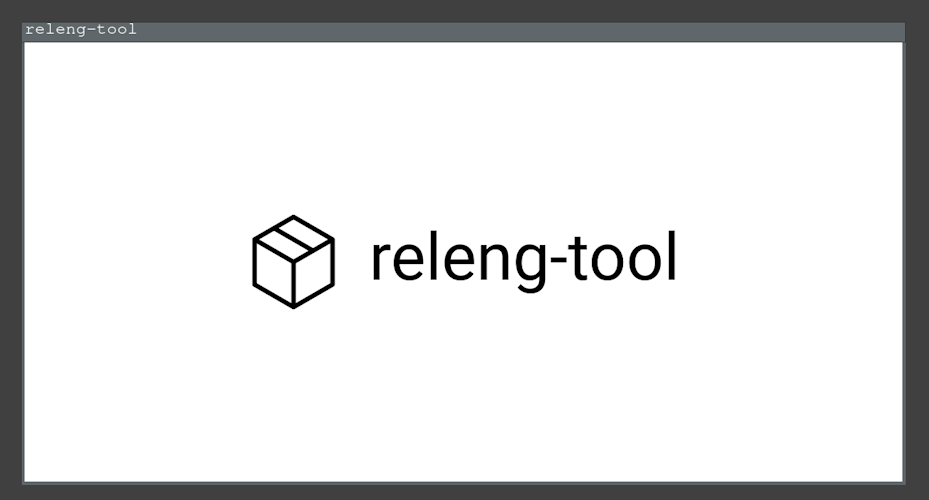

# Tutorial "An SDL example"

```{note}
The goal of this tutorial is to show an example of C-based project, which
is built using a host's pre-installed tools (compilers, etc.). The sample
application created will be run on the host system to show the results of
a build. Typically, a project would configure/use toolchains to build
projects to ensure the resulting files can run on a desired target.
```

This tutorial shows an example creating a [Simple DirectMedia Layer][sdl]
(SDL) sample project, utilizing CMake, which can be built on various
platforms (Linux, OS X or Windows). Users of this tutorial can use any
platform they desire (commands may vary).

## Preparing

To start, make a new folder for the project, folders for each package and
move into the root folder:

```shell-session
$ mkdir -p my-sdl-project/package/libsdl
$ mkdir -p my-sdl-project/package/sample
$ cd my-sdl-project/
```

The "libsdl" package will be used to manage the use of [SDL][sdl], and the
"sample" package will be a representation of our sample application that
uses the SDL library.

## The libsdl package

Inside the `libsdl` package, create a package definition
`my-project/package/libsdl/libsdl` with the following contents:

```python
LIBSDL_LICENSE = ['Zlib']
LIBSDL_LICENSE_FILES = ['LICENSE.txt']
LIBSDL_SITE = 'https://www.libsdl.org/release/SDL2-${LIBSDL_VERSION}.tar.gz'
LIBSDL_TYPE = 'cmake'
LIBSDL_VERSION = '2.28.0'

LIBSDL_CONF_DEFS = {
    'SDL_SHARED': 'ON',
    'SDL_STATIC': 'OFF',
    'SDL_TEST': 'OFF',
}
```

- The SDL library uses a zlib license. We configure `LIBSDL_LICENSE` to the
  equivalent [SPDX][spdx] license identifier, as well as define
  `LIBSDL_LICENSE_FILES` to point to a copy of the license text. Specifying
  license information is not required, but can be helpful when generating
  license data or software bill of materials (SBOM) for a project.
- This example uses SDL v2.28, which we set in the `LIBSDL_VERSION` option.
  The version value is useful for managing output folders and logging versions
  of packages.
- We specify the location to download sources in `LIBSDL_SITE`. We take
  advantage of the `LIBSDL_VERSION` configuration to point to the specific
  version we desire.
- The SDL library uses CMake. This means we can use `LIBSDL_TYPE` to configure
  the helper type and avoid the need to create configure/build scripts to
  run CMake for us (since releng-tool will handle this for us).
- This package has a series of custom options available in its library. We
  use `LIBSDL_CONF_DEFS` to configure various CMake options, for example,
  disabling unit tests. Configuration options will vary per package.

The above `libsdl` package specifies a remote URL to download library
sources. These sources should be validated to ensure data is not corrupted
or manipulated. To do this, create a hash file alongside the package
definition called `libsdl.hash` with the contents:

```text
# gpg verified SDL2-2.28.0.tar.gz.sig | 1528635D8053A57F77D1E08630A59377A7763BE6
sha256 d215ae4541e69d628953711496cd7b0e8b8d5c8d811d5b0f98fdc7fd1422998a libsdl-2.28.0.tar.gz
# locally computed
sha256 9928507f684c1965d07f2b6ef4b4723d5efc2f6b4ab731f743a413c51c319927 LICENSE.txt
```

In this hash file, expected hashes for resources can be configured and checked
when releng-tool attempts to fetch resources from remote sources. Ideally,
hashes provided from a third-party package release can be directly added into
these files (`<hash-type> <hash> <file>`). In this example, SDL provides
GPG signatures of their archives. We manually download the archive and
signature file to verify its contents. Once verified, we generated our own
SHA-256 sum and place it into this hash file (with a helpful comment).

In addition, we also provide a hash of the license document. While not
required, this can be useful in detecting if the license of a package
changes between versions.

Finally, the following shows an example of a patch scenario. For v2.28 SDL's
CMake projects, the library's implementation has trouble when the
installation prefix is empty (which releng-tool may set in Windows
environments). To help fix the CMake definition, we want to patch it before
running a configuration script. Along side the package definition, create
a patch
[`001-empty-prefix-support.patch`](assets/sdl/001-empty-prefix-support.patch)
with the following contents:

```diff
diff -u a/CMakeLists.txt b/CMakeLists.txt

CMAKE_INSTALL_PREFIX may be empty, causing the set of bin_prefix_relpath
to fail. To avoid a failure, avoid using CMAKE_INSTALL_PREFIX when empty.

--- a/CMakeLists.txt    2023-06-20 14:27:57.000000000 -0400
+++ b/CMakeLists.txt    2023-06-25 17:41:30.823627100 -0400
@@ -3067,7 +3067,11 @@
 endif()

 set(prefix ${CMAKE_INSTALL_PREFIX})
-file(RELATIVE_PATH bin_prefix_relpath "${CMAKE_INSTALL_FULL_BINDIR}" "${CMAKE_INSTALL_PREFIX}")
+if(CMAKE_INSTALL_PREFIX STREQUAL "")
+  set(bin_prefix_relpath ${CMAKE_INSTALL_FULL_BINDIR})
+else()
+  file(RELATIVE_PATH bin_prefix_relpath "${CMAKE_INSTALL_FULL_BINDIR}" "${CMAKE_INSTALL_PREFIX}")
+endif()

 set(exec_prefix "\${prefix}")
 set(libdir "\${exec_prefix}/${CMAKE_INSTALL_LIBDIR}")
```

Without getting into the specifics of the patch, the existence of this
patch file will ensure the extracted `CMakeLists.txt` is updated before
`libsdl` package performs its configuration stage. This should ensure this
third-party library can be built on all the platforms we wish to support.

The following shows the expected file structure at this stage of this
tutorial:

```
└── my-sdl-project/
    └── package/
        ├── libsdl/
        │   ├── 001-empty-prefix-support.patch
        │   ├── libsdl
        │   └── libsdl.hash
        └── sample/
```

## The sample package

Next, we will create a "sample" project. The sources for this sample
project would typically be stored in a version control system such as a
Git repository. To simplify this tutorial, we will utilize a `local` VCS
type (typically used for interim development) to help demonstrate the
sample project.

Create a package definition `my-sdl-project/sample/sample` with the
following contents:

```python
SAMPLE_NEEDS = [
    'libsdl',
]

SAMPLE_INTERNAL = True
SAMPLE_TYPE = 'cmake'
SAMPLE_VCS_TYPE = 'local'
```

- We specify a dependency on the `libsdl` package by adding this package in
  a `SAMPLE_NEEDS` list. One or more packages can be specified here
  if needed, and will ensure that `libsdl` is built before any attempts to
  configure/build the sample package.
- This package is then flagged as internal (`SAMPLE_INTERNAL`). We do this
  since this is our own custom package and flagging an internal package
  avoids warnings generated for missing license files or hash files
  (although developers can add hash checks for internal sources if desired).
- The sample program will also be a CMake-based project, so `SAMPLE_TYPE`
  will be configured.
- Lastly, we wil configure the custom `local` type in `SAMPLE_VCS_TYPE` to
  indicate our implementation will be found inside the package folder (until
  we can later add it to Git/etc. repository in the future).

Next, we want to create the sample implementation for this demonstration.
Inside the `sample` package folder, create the following file structure:

```
└── local/
    ├── src/
    │   └── sample/
    │       └── main.c
    └── CMakeLists.txt
```

With the following contents:

[(*CMakeLists.txt*)](assets/sdl/CMakeLists.txt)

```cmake
cmake_minimum_required(VERSION 3.11)

set(BASE_DIR ${CMAKE_CURRENT_SOURCE_DIR})
set(INC_DIR ${BASE_DIR}/src)
set(SRC_DIR ${BASE_DIR}/src/sample)

########################################################################
## support
########################################################################

# targeting c11
set(CMAKE_C_STANDARD 11)
enable_language(C) # msvc hint

# includes
include_directories(${INC_DIR})

set(CMAKE_MACOSX_RPATH 1)
set(CMAKE_INSTALL_RPATH "${CMAKE_INSTALL_PREFIX}/lib")

########################################################################
## dependencies
########################################################################

find_package(SDL2 REQUIRED)
find_package(Threads REQUIRED)

########################################################################
## project
########################################################################

project(sample)

set(SAMPLE_SRCS
    ${SRC_DIR}/main.c
)

add_executable(sample ${SAMPLE_SRCS})
target_link_libraries(sample SDL2::SDL2 SDL2::SDL2main)
target_link_libraries(sample Threads::Threads)
install (TARGETS sample RUNTIME DESTINATION bin)
```

[(*main.c*)](assets/sdl/CMakeLists.txt)

```c
#include <SDL2/SDL.h>
#include <stdbool.h>
#include <stdio.h>

static void err(const char *format, ...)
{
    fprintf(stderr, "(error) ");
    va_list args;
    va_start(args, format);
    vfprintf(stderr, format, args);
    va_end(args);
    fprintf(stderr, "\n");
    fflush(stderr);
}

int main(void)
{
    SDL_Renderer* renderer;
    SDL_Surface* imgSurface;
    SDL_Texture* imgTexture;
    SDL_Window* window;

    if (SDL_Init(SDL_INIT_VIDEO | SDL_INIT_EVENTS) < 0) {
        err("sdl2 init: %s", SDL_GetError());
        return 1;
    }

    window = SDL_CreateWindow("releng-tool",
        SDL_WINDOWPOS_CENTERED, SDL_WINDOWPOS_CENTERED,
        1280, 640, SDL_WINDOW_OPENGL);
    if (window == NULL) {
        err("failed to create window");
        return 1;
    }

    renderer = SDL_CreateRenderer(window, -1, SDL_RENDERER_ACCELERATED);
    if (renderer == NULL) {
        err("failed to create renderer");
        return 1;
    }

    // read the image into a texture
    imgSurface = SDL_LoadBMP("releng-tool.bmp");
    if (imgSurface == NULL) {
        err("failed to load image: %s", SDL_GetError());
        return 1;
    }

    imgTexture = SDL_CreateTextureFromSurface(renderer, imgSurface);
    if (imgTexture == NULL) {
        err("failed to create texture");
        return 1;
    }

    SDL_FreeSurface(imgSurface);

    while (true) {
        // wait until a quit is issued
        SDL_Event e;
        if (SDL_PollEvent(&e)) {
            if (e.type == SDL_QUIT) break;
        }

        // render the image
        SDL_RenderClear(renderer);
        SDL_RenderCopy(renderer, imgTexture, NULL, NULL);
        SDL_RenderPresent(renderer);
    }

    // cleanup
    SDL_DestroyTexture(imgTexture);
    SDL_DestroyRenderer(renderer);
    SDL_DestroyWindow(window);
    SDL_Quit();

    return 0;
}
```

Without getting into specifics of this sample program, the overall goal
is to have an SDL program create a window and show an image.

The following shows the expected file structure at this stage of this
tutorial:

```
└── my-sdl-project/
    └── package/
        ├── libsdl/
        │   ├── 001-empty-prefix-support.patch
        │   ├── libsdl
        │   └── libsdl.hash
        └── sample/
            ├── local/
            │   ├── src/
            │   │   └── sample/
            │   │       └── main.c
            │   └── CMakeLists.txt
            └── sample
```

## Project configuration and post-build script

The project has both `libsdl` and `sample` packages ready to build. For
the `sample` project, the implementation references a `releng-tool.bmp`
image to render for a window, which has not yet been setup. This file should
be added into the build system and installed into the target in the
post-build stages.

Create a new `assets` folder at the root of the project folder. Inside,
place a copy of the [releng-tool.bmp](assets/sdl/releng-tool.bmp) image.
At the root of the project folder, create a post-build script named
`releng-post-build` with the following contents:

```python
assets_dir = releng_join(ROOT_DIR, 'assets')
sample_img = releng_join(assets_dir, 'releng-tool.bmp')
releng_copy_into(sample_img, TARGET_BIN_DIR)
```

- In this example script, we find the project's root path using a `ROOT_DIR`
  helper to find where we locally store the `releng-tool.bmp` image file.
- We then copy the image into the target directory's bin folder to be
  placed alongside the executable we plan to build.

Lastly, we need to create our releng-tool configuration file for the project.
In the root folder, create a `releng` file with the following contents:

```python
packages = [
    'sample',
]

vsdevcmd = True
```

- We explicitly configure releng-tool to load the `sample` package to build.
- Note that we do not need to specify the `libsdl` package since the `sample`
  package will load it implicitly through its dependency configuration.
- Adding `vsdevcmd` will auto-load Visual Studio developer environment
  variables to support Windows-based builds.

The following shows the expected file structure at this stage of this
tutorial:

```
└── my-sdl-project/
    ├── assets/
    │   └── releng-tool.bmp
    ├── package/
    │   ├── libsdl/
    │   │   ├── 001-empty-prefix-support.patch
    │   │   ├── libsdl
    │   │   └── libsdl.hash
    │   └── sample/
    │       ├── local/
    │       │   ├── src/
    │       │   │   └── sample/
    │       │   │       └── main.c
    │       │   └── CMakeLists.txt
    │       └── sample
    ├── releng
    └── releng-post-build
```

## Performing a build

With packages, assets and configurations prepared, the project should be
ready to be built. While in the `my-sdl-project` folder, invoke
`releng-tool`:

```shell-session
$ releng-tool
fetching libsdl...
requesting: https://www.libsdl.org/release/SDL2-2.28.0.tar.gz
[100%] libsdl-2.28.0.tar.gz: 7.7 MiB of 7.7 MiB
completed download (7.7 MiB)
extracting libsdl...
WhatsNew.txt
Xcode
android-project
VisualC-WinRT
...
patching libsdl...
(001-empty-prefix-support.patch)
patching file CMakeLists.txt
configuring libsdl...
building libsdl...
installing libsdl...
configuring sample...
building sample...
installing sample...
generating sbom information...
generating license information...
(success) completed (0:01:15)
```

## Testing

With the project built, we will run the recently created SDL application
to verify our initial releng-tool project definitions. With Linux or
OS X, navigate to the target directory's bin path and invoke the created
sample application:

```shell-session
$ cd output/target/usr/bin
$ LD_LIBRARY_PATH=../lib ./sample
```

With Windows, users can navigate to `output/target/bin` using the file
explorer and click-open the `sample.exe` executable.

In all cases, a window should be presented with the releng-tool logo:




This concludes this tutorial.


[sdl]: https://www.libsdl.org/
[spdx]: https://spdx.org/licenses/